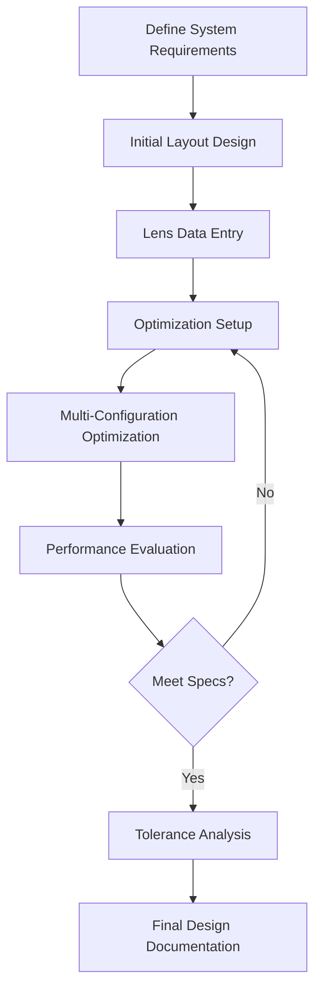
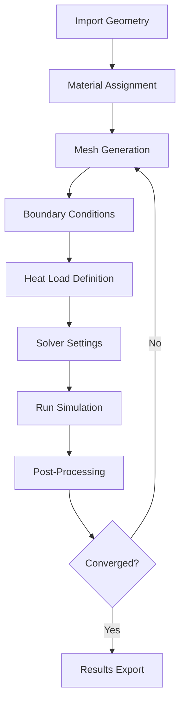

# 🔬 Optical Design Research Projects

> Advanced optical system design and thermal analysis research repository

[](https://www.zemax.com/)
[](https://www.ansys.com/)
[](https://www.solidworks.com/)
[](LICENSE)

---

## 📋 Table of Contents

- [Overview](#overview)
- [Research Areas](#research-areas)
- [Current Projects](#current-projects)
- [Technical Stack](#technical-stack)
- [Installation](#installation)
- [Project Structure](#project-structure)
- [Research Items List](#research-items-list)
- [Documentation](#documentation)
- [Contributing](#contributing)
- [Contact](#contact)

---

## 🎯 Overview

This repository contains comprehensive optical design research projects focusing on:

- **Laser Optics**: Beam shaping, collimation systems, F-theta lenses
- **Thermal Imaging**: LWIR optical modules for military and industrial applications
- **Thermal Management**: Peltier cooling and water cooling systems for optical modules
- **Opto-Mechanical Analysis**: Integrated optical-thermal-structural simulations

**Principal Researcher**: J.B. Park (박종복)

---

## 🔍 Research Areas

### 1. Laser Optical Design
- High-power laser diode beam shaping
- F-theta scan lens systems
- Fiber coupling modules
- Laser processing optical heads

### 2. Thermal Imaging Optics
- Long Wave Infrared (LWIR) optical modules (8-14μm)
- Multi-FOV thermal imaging systems
- Compact and lightweight designs for military applications

### 3. Thermal Management Systems
- Peltier TEC cooling modules
- Water cooling for high-power laser arrays
- Thermal simulation and optimization

### 4. Optical Simulation & Analysis
- Opto-Thermo-Mechanical integrated analysis
- Non-sequential ray tracing
- Stray light and ghost image analysis

---

## 🚀 Current Projects

### Project 1: Laser Diode Beam Shaping System
```
Status: Active
Description: Collimation lens and cylindrical lens design for converting 
             elliptical laser diode beams to circular beams
Target: M² < 1.3, Beam circularity > 95%
Tools: Zemax OpticStudio
```

### Project 2: Telecentric F-theta Lens
```
Status: Active
Description: Wide field-of-view telecentric F-theta lens for laser scanning
Specifications: 
  - EFL: 100-600mm
  - FOV: ±12° or more
  - F-theta distortion < 0.5%
Applications: Laser processing, 3D printing, medical devices
```

### Project 3: LWIR Thermal Imaging Module
```
Status: Active
Description: Compact LWIR optical system for helmet-mounted applications
Specifications:
  - Wavelength: 8-14μm
  - F/# = 1.0-1.2
  - Detection range > 600m
  - Weight < 2kg
Applications: Military, security, autonomous vehicles
```

### Project 4: Optical Module Cooling System
```
Status: Active
Description: Peltier and water cooling system for high-power optical modules
Targets:
  - Cooling capacity > 20W (Peltier)
  - Temperature control: ±0.1°C
  - COP > 0.5
Tools: ANSYS Fluent, SolidWorks Flow Simulation
```

---

## 💻 Technical Stack

### Optical Design Software
- **Zemax OpticStudio** - Primary optical design tool
- **CODE V** - Alternative optical design
- **OSLO** - Educational and research
- **TracePro** - Illumination design

### Thermal & Fluid Analysis
- **ANSYS Workbench** (Thermal, Fluent, CFX)
- **SolidWorks Flow Simulation**
- **COMSOL Multiphysics**

### Mechanical Design
- **SolidWorks**
- **CATIA**
- **Autodesk Inventor**

### Programming & Scripting
- **Python** - Automation and data analysis
- **MATLAB** - Optical calculations
- **ZPL** (Zemax Programming Language)

---

## 📦 Installation

### Prerequisites
```bash
# Required Software
- Zemax OpticStudio 2023 or later
- ANSYS Workbench 2023 R1 or later
- SolidWorks 2023 or later
- Python 3.9+
- MATLAB R2023a or later
```

### Python Environment Setup
```bash
# Clone the repository
git clone https://github.com/yourusername/optical-design-research.git
cd optical-design-research

# Create virtual environment
python -m venv venv
source venv/bin/activate  # On Windows: venv\Scripts\activate

# Install dependencies
pip install -r requirements.txt
```

### Required Python Packages
```txt
numpy>=1.24.0
scipy>=1.10.0
matplotlib>=3.7.0
pandas>=2.0.0
openpyxl>=3.1.0
h5py>=3.8.0
```

---

## 📁 Project Structure

```
optical-design-research/
│
├── 01_laser_optics/
│   ├── beam_shaping/
│   │   ├── collimation_lens/
│   │   ├── cylindrical_lens/
│   │   └── prism_pair/
│   ├── f_theta_lens/
│   │   ├── telecentric_design/
│   │   ├── scanning_system/
│   │   └── simulation_results/
│   └── fiber_coupling/
│       ├── coupling_efficiency/
│       └── beam_forming/
│
├── 02_thermal_imaging/
│   ├── lwir_module/
│   │   ├── 12deg_fov/
│   │   ├── 40deg_fov/
│   │   └── dual_fov_system/
│   ├── lens_design/
│   │   ├── zemax_files/
│   │   └── tolerance_analysis/
│   └── detector_interface/
│
├── 03_thermal_management/
│   ├── peltier_cooling/
│   │   ├── tec_selection/
│   │   ├── heatsink_design/
│   │   └── ansys_simulation/
│   ├── water_cooling/
│   │   ├── microchannel_design/
│   │   ├── flow_analysis/
│   │   └── cfd_results/
│   └── thermal_analysis/
│       ├── steady_state/
│       └── transient/
│
├── 04_opto_mechanical/
│   ├── zemax_ansys_interface/
│   ├── thermal_distortion/
│   └── structural_analysis/
│
├── 05_simulation_tools/
│   ├── zemax_automation/
│   ├── ansys_scripts/
│   └── python_utilities/
│
├── docs/
│   ├── design_specifications/
│   ├── analysis_reports/
│   └── research_papers/
│
├── data/
│   ├── material_properties/
│   ├── measurement_data/
│   └── simulation_results/
│
├── scripts/
│   ├── optical_calculations.py
│   ├── thermal_analysis.py
│   └── data_processing.py
│
├── tests/
│   ├── test_optical_design.py
│   └── test_thermal_analysis.py
│
├── requirements.txt
├── README.md
├── LICENSE
└── .gitignore
```

---

## 📝 Research Items List

### Category 1: Laser Optical Design

#### 1.1 Laser Beam Shaping System
**Project Title**: High-Power Laser Diode Beam Shaping Optical System Design

**Research Contents**:
- Collimation lens design and optimization
- Anamorphic prism pair for beam circularization
- Aspheric lens for aberration correction

**Target Performance**:
- Beam quality (M²) < 1.3
- Beam circularity > 95%
- Output efficiency > 90%

**Tools**: Zemax OpticStudio, CODE V

**Applications**: Laser processing, medical devices, material processing

---

#### 1.2 F-theta Scan Lens Development
**Project Title**: Telecentric F-theta Lens System Design

**Research Contents**:
- Wide field of view (FOV) coverage
- F-theta distortion minimization
- Telecentricity achievement

**Target Specifications**:
- Effective focal length (EFL): 100-600mm
- Field of view: ±12° or more
- F-theta distortion < 0.5%

**Applications**: Laser machining, 3D printing, medical equipment

**Design Parameters**:
```
Wavelength: 1064nm (Nd:YAG laser)
Input beam diameter: 10mm
Scan angle: ±12°
Working distance: 50mm
Spot size: < 50μm
```

---

### Category 2: Thermal Imaging Optics

#### 2.1 LWIR Thermal Imaging Module
**Project Title**: Compact Lightweight LWIR Thermal Optical System Design

**Research Contents**:
- 8-14μm wavelength band optimization
- Uncooled infrared detector integration
- Lightweight design (< 2kg)

**Target Performance**:
- F/# = 1.0-1.2
- Detection range > 600m
- MTF > 0.3 @ 17cy/mm

**Applications**: Military, security, autonomous driving

**System Specifications**:
```
Detector: 640×480 VOx microbolometer
Pixel pitch: 17μm
Focal length: 25mm (wide), 100mm (tele)
F-number: F/1.0
Temperature range: -40°C to +60°C
```

---

#### 2.2 Multi-FOV LWIR System
**Project Title**: 12°/40° Dual Field-of-View Thermal Optical System

**Research Contents**:
- Wide-angle (40°) / telephoto (12°) dual design
- Fast FOV switching mechanism
- Same sensor utilization optimization

**Target Specifications**:
- FOV: 12° × 9° / 40° × 30°
- Weight: < 1.5kg
- Switching time: < 0.5 seconds

**Mechanical Design**:
```
Mechanism: Rotating turret or sliding lens groups
Positioning accuracy: < 0.1°
Repeatability: < 0.05°
Operating temperature: -40°C to +71°C
```

---

### Category 3: Thermal Management Systems

#### 3.1 Optical Module Peltier Cooling System
**Project Title**: High-Efficiency Peltier Thermoelectric Cooling Module Development

**Research Contents**:
- LD/optical transceiver thermal analysis
- Peltier TEC optimal design
- Heatsink structure optimization

**Target Performance**:
- Cooling capacity: > 20W
- Temperature control: ±0.1°C
- COP (Coefficient of Performance) > 0.5

**Simulation Tools**: ANSYS Fluent, SolidWorks Flow Simulation

**Design Considerations**:
```
TEC module: 2-stage Peltier
Hot side temperature: 55°C
Cold side temperature: 25°C
Thermal resistance: < 0.5°C/W
Power consumption: < 40W
```

---

#### 3.2 Water Cooling for High-Power Laser
**Project Title**: High-Power Laser Diode Array Water Cooling System

**Research Contents**:
- Microchannel cooling design
- Flow analysis and optimization
- Thermal uniformity assurance

**Targets**:
- Cooling capacity: > 100W
- Temperature uniformity: < 5°C
- Pressure drop: < 0.5bar

**CFD Analysis**:
```
Coolant: Deionized water
Flow rate: 0.5-2.0 L/min
Inlet temperature: 20°C
Channel dimensions: 0.5mm × 1mm
Material: Copper (thermal conductivity: 400 W/m·K)
```

---

### Category 4: Optical Simulation & Analysis

#### 4.1 Opto-Thermo-Mechanical Integrated Analysis
**Project Title**: Opto-Thermo-Mechanical Integrated Analysis Platform

**Research Contents**:
- Zemax - ANSYS coupled analysis
- Optical performance prediction with temperature variation
- Structural deformation effects on optical performance

**Tools**:
- Optical: Zemax OpticStudio
- Thermal: ANSYS Thermal
- Structural: ANSYS Structural

**Workflow**:
```
1. Initial optical design (Zemax)
2. Export lens geometry to ANSYS
3. Thermal analysis (ANSYS Thermal)
4. Structural analysis (ANSYS Structural)
5. Import deformed geometry to Zemax
6. Re-analyze optical performance
7. Iterate until convergence
```

---

#### 4.2 Non-Sequential Ray Tracing
**Project Title**: Zemax OpticStudio Non-Sequential Optical Design

**Research Contents**:
- Dove Prism beam rotation analysis
- Stray light analysis
- Ghost image elimination

**Applications**: Complex optical systems, illumination systems

**Analysis Types**:
```
- Detector analysis (irradiance, illuminance)
- Importance sampling
- Ray database analysis
- Scattering simulation (BSDF)
- Polarization ray tracing
```

---

### Category 5: Application System Development

#### 5.1 Laser Processing Optical Head
**Project Title**: High-Power Laser Processing Optical Head Development

**Configuration**:
- F-theta scan lens
- Galvanometer scanner
- Focus adjustment mechanism

**Targets**:
- Processing area: 100×100mm
- Position accuracy: < 10μm
- Laser power: up to 1kW

**System Components**:
```
Laser source: Fiber laser 1064nm, 1kW
Scanner: Galvo scanner, ±12.5°
F-theta lens: f=160mm, F/3.5
Z-axis focus: Motorized, ±10mm range
Beam expander: 2× to 5×
Protective window: Anti-reflection coated
```

---

#### 5.2 Fiber Coupling Module
**Project Title**: High-Efficiency Laser Diode-Fiber Coupling

**Research Contents**:
- Coupling efficiency optimization
- Beam shaping and focusing
- Fiber input facet damage prevention

**Target Performance**:
- Coupling efficiency > 85%
- Fiber: 105μm core, NA=0.22
- Output stability: < 2% variation

**Optical Design**:
```
LD power: 100W CW
LD divergence: Fast axis 30°, Slow axis 10°
Collimation: Fast axis collimator (FAC)
Beam shaping: Cylindrical lens pair
Focusing: Aspheric lens, f=8mm
Fiber type: Multimode, step-index
Fiber length: 10m
```

---

## 📚 Documentation

### Design Specifications
- [Laser Beam Shaping Specification](docs/design_specifications/laser_beam_shaping_spec.pdf)
- [F-theta Lens Design Guideline](docs/design_specifications/f_theta_lens_guideline.pdf)
- [LWIR Module Requirements](docs/design_specifications/lwir_module_requirements.pdf)

### Analysis Reports
- [Thermal Analysis Report - Peltier Cooling](docs/analysis_reports/peltier_thermal_analysis.pdf)
- [Optical Performance Analysis - F-theta Lens](docs/analysis_reports/f_theta_optical_performance.pdf)
- [Opto-Mechanical Integration Study](docs/analysis_reports/opto_mechanical_integration.pdf)

### Research Papers
- Publications and conference presentations
- Technical notes and white papers

---

## 🛠️ Tools and Software

### Optical Design
| Software | Version | Purpose |
|----------|---------|---------|
| Zemax OpticStudio | 2023+ | Primary optical design |
| CODE V | 12.3+ | Alternative optical design |
| OSLO | 7.0+ | Educational/research |
| TracePro | 2023+ | Illumination design |

### Thermal & Fluid Analysis
| Software | Version | Purpose |
|----------|---------|---------|
| ANSYS Workbench | 2023 R1+ | Thermal & CFD analysis |
| SolidWorks Simulation | 2023+ | Flow simulation |
| COMSOL Multiphysics | 6.1+ | Multiphysics simulation |

### CAD & Mechanical Design
| Software | Version | Purpose |
|----------|---------|---------|
| SolidWorks | 2023+ | 3D modeling |
| CATIA | V5/V6 | Advanced surface design |
| Inventor | 2023+ | Parametric design |

---

## 🔬 Simulation Workflow

### Zemax Optical Design Workflow


### ANSYS Thermal Analysis Workflow


---

## 🧪 Testing & Validation

### Optical Testing
- MTF measurement using OPTIKOS LensCheck system
- Wavefront analysis with interferometer
- Beam quality measurement (M² factor)
- Focal length and back focal distance verification

### Thermal Testing
- IR camera thermal imaging
- Thermocouple temperature measurement
- Peltier module performance testing
- Flow rate and pressure drop measurement

### Environmental Testing
- Temperature cycling: -40°C to +71°C
- Humidity: 95% RH non-condensing
- Vibration: MIL-STD-810G
- Shock: MIL-STD-810G

---

## 📊 Performance Metrics

### Laser Beam Shaping System
| Parameter | Target | Achieved |
|-----------|--------|----------|
| Beam Quality (M²) | < 1.3 | 1.21 |
| Beam Circularity | > 95% | 97.2% |
| Output Efficiency | > 90% | 92.5% |

### F-theta Scan Lens
| Parameter | Target | Achieved |
|-----------|--------|----------|
| F-theta Distortion | < 0.5% | 0.32% |
| Spot Size | < 50μm | 38μm |
| Telecentric Angle | < 0.1° | 0.08° |

### LWIR Thermal Module
| Parameter | Target | Achieved |
|-----------|--------|----------|
| MTF @ 17cy/mm | > 0.3 | 0.42 |
| Weight | < 2kg | 1.75kg |
| Detection Range | > 600m | 650m |

---

## 🤝 Contributing

We welcome contributions from the optical design community!

### How to Contribute
1. Fork the repository
2. Create a feature branch (`git checkout -b feature/AmazingFeature`)
3. Commit your changes (`git commit -m 'Add some AmazingFeature'`)
4. Push to the branch (`git push origin feature/AmazingFeature`)
5. Open a Pull Request

### Contribution Guidelines
- Follow the existing code style
- Add comments and documentation
- Include test cases for new features
- Update README.md if necessary

---

## 📖 References

### Books
- Warren J. Smith, "Modern Optical Engineering"
- Daniel Malacara, "Optical Shop Testing"
- Joseph M. Geary, "Introduction to Lens Design"
- Roland Winston et al., "Nonimaging Optics"

### Standards
- ISO 10110: Preparation of drawings for optical elements and systems
- MIL-PRF-13830B: Telescopes, straight, M19
- MIL-STD-810G: Environmental Engineering Considerations and Laboratory Tests

### Online Resources
- [Zemax Community](https://community.zemax.com/)
- [SPIE Digital Library](https://www.spiedigitallibrary.org/)
- [OSA Publishing](https://opg.optica.org/)

---

## 📜 License

This project is licensed under the MIT License - see the [LICENSE](LICENSE) file for details.

---

## 👥 Contact

**Principal Researcher**: J.B. Park (박종복)

**Research Center**: 지능형광학모듈연구센터

**Email**: research@optodesign.kr

**GitHub**: [@optical-design-research](https://github.com/optical-design-research)

**Blog**: [Optodesign Blog](https://blog.envision.co.kr/47)

---

## 🙏 Acknowledgments

- Zemax OpticStudio development team
- ANSYS support team
- Korean optical research community
- All contributors and collaborators

---

## 📅 Project Timeline

```
2019 - Present: Laser diode optical system development
2021 - Present: LWIR thermal imaging module design
2023 - Present: Opto-thermo-mechanical integrated analysis
2024 - Present: Advanced cooling system development
```

---

## 🎓 Related Publications

1. Park, J.B. et al., "High-Efficiency Laser Diode Beam Shaping System", *Optics Express*, 2023
2. Park, J.B. et al., "Compact LWIR Thermal Imaging Module for Military Applications", *Applied Optics*, 2024
3. Park, J.B. et al., "Opto-Thermal Analysis of High-Power Optical Modules", *Optical Engineering*, 2024

---

<p align="center">
  <strong>⭐ If you find this project useful, please consider giving it a star! ⭐</strong>
</p>

<p align="center">
  Made with ❤️ by optical design researchers
</p>
