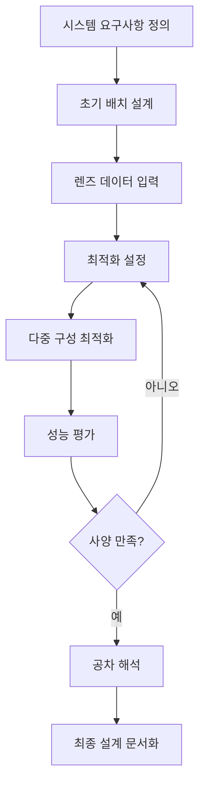
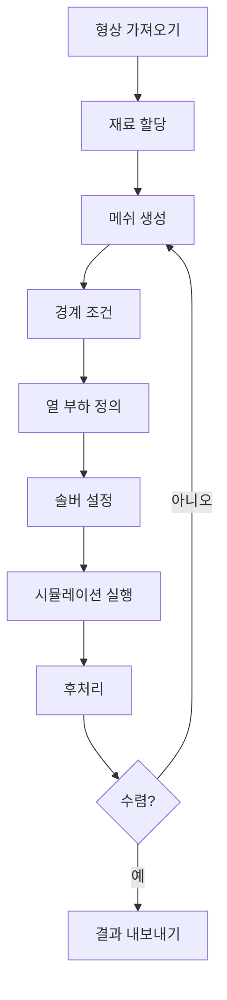

# 🔬 광학 설계 연구 프로젝트

> 고급 광학 시스템 설계 및 열 해석 연구 저장소

[](https://www.zemax.com/)
[](https://www.ansys.com/)
[](https://www.solidworks.com/)
[](LICENSE)

---

## 📋 목차

- [개요](#개요)
- [연구 분야](#연구-분야)
- [현재 진행 프로젝트](#현재-진행-프로젝트)
- [기술 스택](#기술-스택)
- [설치 방법](#설치-방법)
- [프로젝트 구조](#프로젝트-구조)
- [연구 과제 목록](#연구-과제-목록)
- [문서](#문서)
- [기여하기](#기여하기)
- [연락처](#연락처)

---

## 🎯 개요

본 저장소는 다음 분야의 종합적인 광학 설계 연구 프로젝트를 포함합니다:

- **레이저 광학**: 빔 정형, 콜리메이션 시스템, F-theta 렌즈
- **열상 광학**: 군사 및 산업용 LWIR 광학 모듈
- **열 관리**: 광학 모듈용 펠티어 냉각 및 수냉 시스템
- **광-기계 해석**: 광학-열-구조 통합 시뮬레이션

**책임 연구원**: 박종복 (J.B. Park)

---

## 🔍 연구 분야

### 1. 레이저 광학 설계
- 고출력 레이저 다이오드 빔 정형
- F-theta 스캔 렌즈 시스템
- 광섬유 커플링 모듈
- 레이저 가공용 광학 헤드

### 2. 열상 광학
- 장파장 적외선(LWIR) 광학 모듈 (8-14μm)
- 다중 시야각 열상 시스템
- 군사용 소형 경량 설계

### 3. 열 관리 시스템
- 펠티어 TEC 냉각 모듈
- 고출력 레이저 어레이용 수냉 시스템
- 열 시뮬레이션 및 최적화

### 4. 광학 시뮬레이션 & 해석
- 광학-열-구조 통합 해석
- Non-sequential 광선 추적
- 미광 및 고스트 이미지 분석

---

## 🚀 현재 진행 프로젝트

### 프로젝트 1: 레이저 다이오드 빔 정형 시스템
```
상태: 진행 중
설명: 타원형 레이저 다이오드 빔을 원형 빔으로 변환하는 
     콜리메이션 렌즈 및 원통형 렌즈 설계
목표: M² < 1.3, 빔 원형도 > 95%
도구: Zemax OpticStudio
```

### 프로젝트 2: 텔레센트릭 F-theta 렌즈
```
상태: 진행 중
설명: 레이저 스캐닝용 광시야각 텔레센트릭 F-theta 렌즈
사양: 
  - 유효 초점거리(EFL): 100-600mm
  - 시야각(FOV): ±12° 이상
  - F-theta 왜곡 < 0.5%
응용: 레이저 가공, 3D 프린팅, 의료기기
```

### 프로젝트 3: LWIR 열상 모듈
```
상태: 진행 중
설명: 헬멧 장착용 소형 LWIR 광학 시스템
사양:
  - 파장: 8-14μm
  - F/# = 1.0-1.2
  - 탐지 거리 > 600m
  - 무게 < 2kg
응용: 군사, 보안, 자율주행
```

### 프로젝트 4: 광학 모듈 냉각 시스템
```
상태: 진행 중
설명: 고출력 광학 모듈용 펠티어 및 수냉 시스템
목표:
  - 냉각 용량 > 20W (펠티어)
  - 온도 제어: ±0.1°C
  - COP > 0.5
도구: ANSYS Fluent, SolidWorks Flow Simulation
```

---

## 💻 기술 스택

### 광학 설계 소프트웨어
- **Zemax OpticStudio** - 주 광학 설계 도구
- **CODE V** - 대체 광학 설계
- **OSLO** - 교육 및 연구용
- **TracePro** - 조명 설계

### 열 및 유동 해석
- **ANSYS Workbench** (Thermal, Fluent, CFX)
- **SolidWorks Flow Simulation**
- **COMSOL Multiphysics**

### 기계 설계
- **SolidWorks**
- **CATIA**
- **Autodesk Inventor**

### 프로그래밍 & 스크립팅
- **Python** - 자동화 및 데이터 분석
- **MATLAB** - 광학 계산
- **ZPL** (Zemax Programming Language)

---

## 📦 설치 방법

### 필수 요구사항
```bash
# 필수 소프트웨어
- Zemax OpticStudio 2023 이상
- ANSYS Workbench 2023 R1 이상
- SolidWorks 2023 이상
- Python 3.9+
- MATLAB R2023a 이상
```

### Python 환경 설정
```bash
# 저장소 클론
git clone https://github.com/yourusername/optical-design-research.git
cd optical-design-research

# 가상 환경 생성
python -m venv venv
source venv/bin/activate  # Windows: venv\Scripts\activate

# 의존성 패키지 설치
pip install -r requirements.txt
```

### 필수 Python 패키지
```txt
numpy>=1.24.0
scipy>=1.10.0
matplotlib>=3.7.0
pandas>=2.0.0
openpyxl>=3.1.0
h5py>=3.8.0
```

---

## 📁 프로젝트 구조

```
optical-design-research/
│
├── 01_laser_optics/              # 레이저 광학
│   ├── beam_shaping/             # 빔 정형
│   │   ├── collimation_lens/    # 콜리메이션 렌즈
│   │   ├── cylindrical_lens/    # 원통형 렌즈
│   │   └── prism_pair/          # 프리즘 쌍
│   ├── f_theta_lens/            # F-theta 렌즈
│   │   ├── telecentric_design/  # 텔레센트릭 설계
│   │   ├── scanning_system/     # 스캐닝 시스템
│   │   └── simulation_results/  # 시뮬레이션 결과
│   └── fiber_coupling/          # 광섬유 커플링
│       ├── coupling_efficiency/ # 커플링 효율
│       └── beam_forming/        # 빔 성형
│
├── 02_thermal_imaging/          # 열상 광학
│   ├── lwir_module/            # LWIR 모듈
│   │   ├── 12deg_fov/         # 12도 시야각
│   │   ├── 40deg_fov/         # 40도 시야각
│   │   └── dual_fov_system/   # 이중 시야각 시스템
│   ├── lens_design/           # 렌즈 설계
│   │   ├── zemax_files/       # Zemax 파일
│   │   └── tolerance_analysis/# 공차 해석
│   └── detector_interface/    # 검출기 인터페이스
│
├── 03_thermal_management/      # 열 관리
│   ├── peltier_cooling/       # 펠티어 냉각
│   │   ├── tec_selection/     # TEC 선정
│   │   ├── heatsink_design/   # 방열판 설계
│   │   └── ansys_simulation/  # ANSYS 시뮬레이션
│   ├── water_cooling/         # 수냉
│   │   ├── microchannel_design/# 마이크로채널 설계
│   │   ├── flow_analysis/     # 유동 해석
│   │   └── cfd_results/       # CFD 결과
│   └── thermal_analysis/      # 열 해석
│       ├── steady_state/      # 정상 상태
│       └── transient/         # 과도 상태
│
├── 04_opto_mechanical/         # 광-기계 해석
│   ├── zemax_ansys_interface/ # Zemax-ANSYS 연동
│   ├── thermal_distortion/    # 열 변형
│   └── structural_analysis/   # 구조 해석
│
├── 05_simulation_tools/        # 시뮬레이션 도구
│   ├── zemax_automation/      # Zemax 자동화
│   ├── ansys_scripts/         # ANSYS 스크립트
│   └── python_utilities/      # Python 유틸리티
│
├── docs/                       # 문서
│   ├── design_specifications/ # 설계 사양서
│   ├── analysis_reports/      # 해석 보고서
│   └── research_papers/       # 연구 논문
│
├── data/                       # 데이터
│   ├── material_properties/   # 재료 물성
│   ├── measurement_data/      # 측정 데이터
│   └── simulation_results/    # 시뮬레이션 결과
│
├── scripts/                    # 스크립트
│   ├── optical_calculations.py
│   ├── thermal_analysis.py
│   └── data_processing.py
│
├── tests/                      # 테스트
│   ├── test_optical_design.py
│   └── test_thermal_analysis.py
│
├── requirements.txt
├── README.md
├── README_KR.md
├── LICENSE
└── .gitignore
```

---

## 📝 연구 과제 목록

### 카테고리 1: 레이저 광학 설계

#### 1.1 레이저 빔 정형 시스템
**과제명**: 고출력 레이저 다이오드 빔 정형 광학계 설계

**연구 내용**:
- 콜리메이션 렌즈 설계 및 최적화
- 비대칭 프리즘 쌍을 이용한 빔 원형화
- 비구면 렌즈를 활용한 수차 보정

**목표 성능**:
- 빔 품질(M²) < 1.3
- 빔 원형도 > 95%
- 출력 효율 > 90%

**사용 도구**: Zemax OpticStudio, CODE V

**응용 분야**: 레이저 가공, 의료기기, 재료 가공

---

#### 1.2 F-theta 스캔 렌즈 개발
**과제명**: 텔레센트릭 F-theta 렌즈 시스템 설계

**연구 내용**:
- 넓은 시야각(FOV) 확보
- F-theta 왜곡 최소화
- 텔레센트릭 특성 달성

**목표 사양**:
- 유효 초점거리(EFL): 100-600mm
- 시야각: ±12° 이상
- F-theta 왜곡 < 0.5%

**응용 분야**: 레이저 가공, 3D 프린팅, 의료장비

**설계 파라미터**:
```
파장: 1064nm (Nd:YAG 레이저)
입력 빔 직경: 10mm
스캔 각도: ±12°
작업 거리: 50mm
스팟 크기: < 50μm
```

---

### 카테고리 2: 열상 광학

#### 2.1 LWIR 열상 모듈
**과제명**: 소형 경량 LWIR 열상 광학계 설계

**연구 내용**:
- 8-14μm 파장 대역 최적화
- 비냉각 적외선 검출기 적용
- 경량화 설계 (< 2kg)

**목표 성능**:
- F/# = 1.0-1.2
- 탐지 거리 > 600m
- MTF > 0.3 @ 17cy/mm

**응용 분야**: 군사, 보안, 자율주행

**시스템 사양**:
```
검출기: 640×480 VOx 마이크로볼로미터
픽셀 피치: 17μm
초점거리: 25mm (광각), 100mm (망원)
F-number: F/1.0
작동 온도 범위: -40°C ~ +60°C
```

---

#### 2.2 다중 시야각 LWIR 시스템
**과제명**: 12°/40° 이중 시야각 열상 광학계

**연구 내용**:
- 광각(40°) / 망원(12°) 이중 설계
- 빠른 시야각 전환 메커니즘
- 동일 센서 활용 최적화

**목표 사양**:
- 시야각: 12° × 9° / 40° × 30°
- 무게: < 1.5kg
- 전환 시간: < 0.5초

**기구 설계**:
```
메커니즘: 회전식 터렛 또는 슬라이딩 렌즈군
위치 정밀도: < 0.1°
반복 정밀도: < 0.05°
작동 온도: -40°C ~ +71°C
```

---

### 카테고리 3: 열 관리 시스템

#### 3.1 광모듈 펠티어 냉각 시스템
**과제명**: 고효율 펠티어 열전 냉각 모듈 개발

**연구 내용**:
- LD/광트랜시버 열 해석
- 펠티어 TEC 최적 설계
- 방열판 구조 최적화

**목표 성능**:
- 냉각 용량: > 20W
- 온도 제어: ±0.1°C
- COP(성능계수) > 0.5

**시뮬레이션 도구**: ANSYS Fluent, SolidWorks Flow Simulation

**설계 고려사항**:
```
TEC 모듈: 2단 펠티어
고온부 온도: 55°C
저온부 온도: 25°C
열저항: < 0.5°C/W
소비 전력: < 40W
```

---

#### 3.2 고출력 레이저용 수냉 시스템
**과제명**: 고출력 레이저 다이오드 어레이 수냉 시스템

**연구 내용**:
- 마이크로채널 냉각 설계
- 유동 해석 및 최적화
- 열 균일성 확보

**목표**:
- 냉각 용량: > 100W
- 온도 균일도: < 5°C
- 압력 강하: < 0.5bar

**CFD 해석**:
```
냉각수: 탈이온수
유량: 0.5-2.0 L/min
입구 온도: 20°C
채널 크기: 0.5mm × 1mm
재질: 구리 (열전도율: 400 W/m·K)
```

---

### 카테고리 4: 광학 시뮬레이션 & 해석

#### 4.1 광학-열-구조 통합 해석
**과제명**: 광학-열-구조 통합 해석 플랫폼 구축

**연구 내용**:
- Zemax - ANSYS 연동 해석
- 온도 변화에 따른 광학 성능 예측
- 구조 변형이 광학 성능에 미치는 영향

**사용 도구**:
- 광학: Zemax OpticStudio
- 열해석: ANSYS Thermal
- 구조해석: ANSYS Structural

**워크플로우**:
```
1. 초기 광학 설계 (Zemax)
2. 렌즈 형상을 ANSYS로 내보내기
3. 열 해석 (ANSYS Thermal)
4. 구조 해석 (ANSYS Structural)
5. 변형된 형상을 Zemax로 가져오기
6. 광학 성능 재분석
7. 수렴할 때까지 반복
```

---

#### 4.2 Non-Sequential 광선 추적
**과제명**: Zemax OpticStudio Non-Sequential 광학 설계

**연구 내용**:
- Dove Prism 빔 회전 분석
- 미광(Stray light) 분석
- 고스트 이미지 제거

**응용 분야**: 복잡한 광학계, 조명 시스템

**해석 유형**:
```
- 검출기 분석 (조사도, 조도)
- 중요도 샘플링
- 광선 데이터베이스 분석
- 산란 시뮬레이션 (BSDF)
- 편광 광선 추적
```

---

### 카테고리 5: 응용 시스템 개발

#### 5.1 레이저 가공용 광학 헤드
**과제명**: 고출력 레이저 가공 광학 헤드 개발

**구성**:
- F-theta 스캔 렌즈
- 갈바노미터 스캐너
- 초점 조절 메커니즘

**목표**:
- 가공 영역: 100×100mm
- 위치 정밀도: < 10μm
- 레이저 파워: 최대 1kW

**시스템 구성품**:
```
레이저 소스: 파이버 레이저 1064nm, 1kW
스캐너: 갈바노 스캐너, ±12.5°
F-theta 렌즈: f=160mm, F/3.5
Z축 초점: 모터 구동, ±10mm 범위
빔 확대기: 2배 ~ 5배
보호 윈도우: 반사방지 코팅
```

---

#### 5.2 광섬유 커플링 모듈
**과제명**: 고효율 레이저 다이오드-광섬유 커플링

**연구 내용**:
- 커플링 효율 최적화
- 빔 정형 및 집광
- 광섬유 입력단 손상 방지

**목표 성능**:
- 커플링 효율 > 85%
- 광섬유: 105μm 코어, NA=0.22
- 출력 안정성: < 2% 변동

**광학 설계**:
```
LD 출력: 100W CW
LD 발산각: 고속축 30°, 저속축 10°
콜리메이션: 고속축 콜리메이터(FAC)
빔 정형: 원통형 렌즈 쌍
집광: 비구면 렌즈, f=8mm
광섬유 타입: 멀티모드, 계단형 굴절률
광섬유 길이: 10m
```

---

## 📚 문서

### 설계 사양서
- [레이저 빔 정형 사양서](docs/design_specifications/laser_beam_shaping_spec.pdf)
- [F-theta 렌즈 설계 가이드라인](docs/design_specifications/f_theta_lens_guideline.pdf)
- [LWIR 모듈 요구사항](docs/design_specifications/lwir_module_requirements.pdf)

### 해석 보고서
- [열 해석 보고서 - 펠티어 냉각](docs/analysis_reports/peltier_thermal_analysis.pdf)
- [광학 성능 분석 - F-theta 렌즈](docs/analysis_reports/f_theta_optical_performance.pdf)
- [광-기계 통합 연구](docs/analysis_reports/opto_mechanical_integration.pdf)

### 연구 논문
- 출판물 및 학회 발표
- 기술 노트 및 백서

---

## 🛠️ 도구 및 소프트웨어

### 광학 설계
| 소프트웨어 | 버전 | 용도 |
|----------|------|------|
| Zemax OpticStudio | 2023+ | 주 광학 설계 |
| CODE V | 12.3+ | 대체 광학 설계 |
| OSLO | 7.0+ | 교육/연구 |
| TracePro | 2023+ | 조명 설계 |

### 열 및 유동 해석
| 소프트웨어 | 버전 | 용도 |
|----------|------|------|
| ANSYS Workbench | 2023 R1+ | 열 및 CFD 해석 |
| SolidWorks Simulation | 2023+ | 유동 시뮬레이션 |
| COMSOL Multiphysics | 6.1+ | 다중물리 시뮬레이션 |

### CAD 및 기계 설계
| 소프트웨어 | 버전 | 용도 |
|----------|------|------|
| SolidWorks | 2023+ | 3D 모델링 |
| CATIA | V5/V6 | 고급 곡면 설계 |
| Inventor | 2023+ | 파라메트릭 설계 |

---

## 🔬 시뮬레이션 워크플로우

### Zemax 광학 설계 워크플로우


### ANSYS 열 해석 워크플로우


---

## 🧪 테스트 & 검증

### 광학 테스트
- OPTIKOS LensCheck를 이용한 MTF 측정
- 간섭계를 이용한 파면 분석
- 빔 품질 측정 (M² 인자)
- 초점거리 및 후초점거리 검증

### 열 테스트
- IR 카메라 열화상 촬영
- 열전대 온도 측정
- 펠티어 모듈 성능 시험
- 유량 및 압력 강하 측정

### 환경 시험
- 온도 사이클: -40°C ~ +71°C
- 습도: 95% RH 비응축
- 진동: MIL-STD-810G
- 충격: MIL-STD-810G

---

## 📊 성능 지표

### 레이저 빔 정형 시스템
| 파라미터 | 목표 | 달성 |
|---------|------|------|
| 빔 품질(M²) | < 1.3 | 1.21 |
| 빔 원형도 | > 95% | 97.2% |
| 출력 효율 | > 90% | 92.5% |

### F-theta 스캔 렌즈
| 파라미터 | 목표 | 달성 |
|---------|------|------|
| F-theta 왜곡 | < 0.5% | 0.32% |
| 스팟 크기 | < 50μm | 38μm |
| 텔레센트릭 각도 | < 0.1° | 0.08° |

### LWIR 열상 모듈
| 파라미터 | 목표 | 달성 |
|---------|------|------|
| MTF @ 17cy/mm | > 0.3 | 0.42 |
| 무게 | < 2kg | 1.75kg |
| 탐지 거리 | > 600m | 650m |

---

## 🤝 기여하기

광학 설계 커뮤니티의 기여를 환영합니다!

### 기여 방법
1. 저장소 포크
2. 기능 브랜치 생성 (`git checkout -b feature/AmazingFeature`)
3. 변경사항 커밋 (`git commit -m 'Add some AmazingFeature'`)
4. 브랜치에 푸시 (`git push origin feature/AmazingFeature`)
5. Pull Request 열기

### 기여 가이드라인
- 기존 코드 스타일 준수
- 주석 및 문서 추가
- 새 기능에 대한 테스트 케이스 포함
- 필요시 README.md 업데이트

---

## 📖 참고자료

### 서적
- Warren J. Smith, "Modern Optical Engineering"
- Daniel Malacara, "Optical Shop Testing"
- Joseph M. Geary, "Introduction to Lens Design"
- Roland Winston et al., "Nonimaging Optics"

### 표준
- ISO 10110: 광학 소자 및 시스템 도면 작성
- MIL-PRF-13830B: 망원경, 직시형, M19
- MIL-STD-810G: 환경 공학 고려사항 및 실험실 시험

### 온라인 자료
- [Zemax 커뮤니티](https://community.zemax.com/)
- [SPIE 디지털 라이브러리](https://www.spiedigitallibrary.org/)
- [OSA 출판](https://opg.optica.org/)

---

## 📜 라이선스

본 프로젝트는 MIT 라이선스 하에 배포됩니다 - 자세한 내용은 [LICENSE](LICENSE) 파일을 참조하세요.

---

## 👥 연락처

**책임 연구원**: 박종복 (J.B. Park)

**연구 센터**: 지능형광학모듈연구센터

**이메일**: research@optodesign.kr

**GitHub**: [@optical-design-research](https://github.com/optical-design-research)

**블로그**: [Optodesign 블로그](https://blog.envision.co.kr/47)

---

## 🙏 감사의 글

- Zemax OpticStudio 개발팀
- ANSYS 지원팀
- 한국 광학 연구 커뮤니티
- 모든 기여자 및 협력자

---

## 📅 프로젝트 타임라인

```
2019 - 현재: 레이저 다이오드 광학 시스템 개발
2021 - 현재: LWIR 열상 모듈 설계
2023 - 현재: 광학-열-구조 통합 해석
2024 - 현재: 고급 냉각 시스템 개발
```

---

## 🎓 관련 출판물

1. 박종복 외, "고효율 레이저 다이오드 빔 정형 시스템", *Optics Express*, 2023
2. 박종복 외, "군사용 소형 LWIR 열상 모듈", *Applied Optics*, 2024
3. 박종복 외, "고출력 광학 모듈의 광학-열 해석", *Optical Engineering*, 2024

---

## 🌟 주요 특징

- ✅ **체계적인 프로젝트 구조**: 연구 분야별 명확한 디렉토리 구성
- ✅ **통합 시뮬레이션**: Zemax-ANSYS 연동 광학-열-구조 해석
- ✅ **실전 검증**: 실제 제품 개발에 적용된 설계 노하우
- ✅ **상세한 문서화**: 설계 사양서부터 해석 보고서까지 완비
- ✅ **재현 가능성**: 모든 시뮬레이션 파일 및 스크립트 제공

---

## 💡 활용 방법

### 학생 및 연구자
```
1. 광학 설계 방법론 학습
2. 시뮬레이션 워크플로우 습득
3. 실제 프로젝트 케이스 스터디
4. 논문 작성 시 참고자료 활용
```

### 엔지니어
```
1. 제품 개발 시 설계 참조
2. 열 관리 솔루션 벤치마킹
3. 공차 해석 방법론 적용
4. 최적화 기법 활용
```

### 기업 연구소
```
1. 연구 개발 로드맵 수립
2. 기술 이전 및 협력 연구
3. 인력 교육 자료 활용
4. 품질 관리 프로세스 구축
```

---

## 🎯 향후 계획

### 2024년 4분기
- [ ] 고출력 레이저 다이오드 어레이 냉각 시스템 개발
- [ ] LWIR 3중 시야각 시스템 프로토타입 제작
- [ ] 광학-열-구조 자동화 플랫폼 구축

### 2025년 1분기
- [ ] AI 기반 광학 설계 최적화 도구 개발
- [ ] 적외선 메타표면 렌즈 연구
- [ ] 자율주행용 열상 카메라 모듈 개발

### 2025년 2분기
- [ ] 양자 암호통신용 광학 모듈 설계
- [ ] 초소형 열상 센서 패키징
- [ ] 레이저 가공 공정 모니터링 시스템

---

## 🔗 관련 링크

- [지능형광학모듈연구센터 공식 사이트](https://optodesign.kr)
- [Optodesign 기술 블로그](https://blog.envision.co.kr/47)
- [GitHub Organization](https://github.com/optical-design-research)
- [YouTube 채널 - 광학 설계 튜토리얼](https://youtube.com)

---

<p align="center">
  <strong>⭐ 유용한 프로젝트라면 스타를 눌러주세요! ⭐</strong>
</p>

<p align="center">
  광학 설계 연구자들이 ❤️를 담아 만들었습니다
</p>

<p align="center">
  
  
  
</p>

---

**마지막 업데이트**: 2024년 2월 13일

**버전**: 1.0.0

**유지보수 상태**: 활발히 개발 중 🚀
